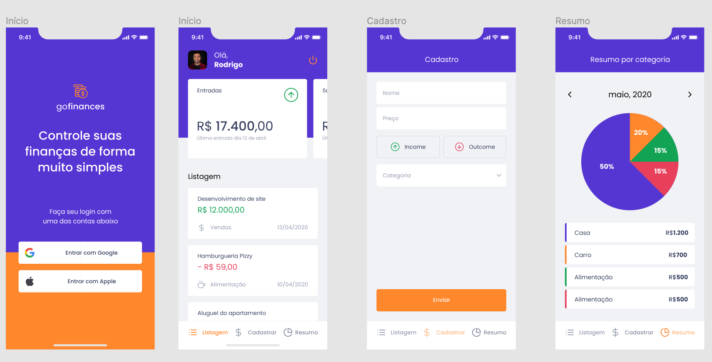

<h1 align=center>
  💲 GoFinances 💲
</h1>

<h3 align=center>
  Gerencie suas transações de maneira inteligente
</h3>

## 📷 Preview do projeto

<div align=center>
  
</div>

## 🕵️ Sobre 

O gofinances é uma ótima alternativa para acompanhamento de transações financeiras. Ele fornece uma descrição dos registros criados e um balanço dos valores, para você, de forma simples e elegante.

## 🚀 Tecnologias

✔ [TypeScript](https://www.typescriptlang.org/)
<br />
✔ [React Native](https://reactnative.dev/)
<br />
✔ [Styled Components](https://styled-components.com/docs/basics)
<br />
✔ [React Navigation](https://reactnavigation.org/)
<br />
✔ [React Native Gesture Handler](https://docs.swmansion.com/react-native-gesture-handler/)
<br />
✔ [React Hook Form](https://react-hook-form.com/)
<br />
✔ [Yup](https://github.com/jquense/yup)
<br />
✔ [Expo](https://expo.io/)
<br />

## 🔍 Requisitos de software

<li><a href="https://yarnpkg.com/">Instalar o yarn</a></li>
<li><a href="https://react-native.rocketseat.dev/">Instalar e configurar o Android Studio (opcional)</a></li>

## ⚙ Configurações

Para rodar o projeto, basta executar os seguintes comandos, em seu terminal com git

```bash
  # Faça um clone do repositório

  git clone <link-do-repositório>

  # Navegue até a pasta do projeto e baixe as dependências

  cd gofinances && yarn

  # Rode o metro bundler

  yarn start

  # E, em outro terminal, execute

  yarn android # Necessita do Android Studio

  # ou

  yarn ios # Funciona apenas no Mac
```

## 📝 Licença
Esse projeto se encontra sob a licença <strong>MIT</strong>. Para mais informações, acesse o arquivo <strong>LICENSE</strong>.

<p>Made with 💜 by Leonardo Jorge<p>
<p>
    <a href="https://www.linkedin.com/in/leonardo-jorge-a88a561b6/" target="_blank">
        
    </a>
    <a href="mailto:leonardoti4437@gmail.com" target="_blank">
        
    </a>
</p>

